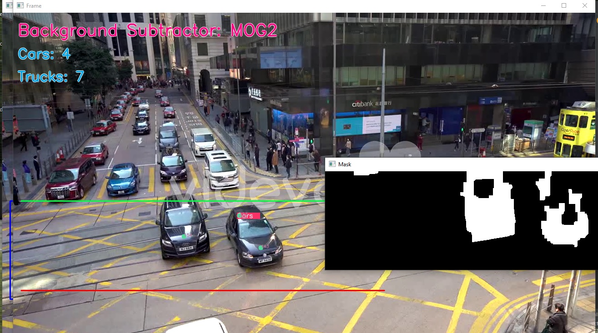

# Traffic Monitoring System Using Computer Vision
> Detect and Count cars and trucks via video feed

## Table of Contents
- [Traffic Monitoring System Using Computer Vision](#traffic-monitoring-system-using-computer-vision)
  - [Table of Contents](#table-of-contents)
  - [General Information](#general-information)
  - [Technologies Used](#technologies-used)
  - [Features](#features)
  - [Screenshots](#screenshots)
  - [Setup](#setup)
  - [Usage](#usage)
  - [Project Status](#project-status)
  - [Contact](#contact)


## General Information
- A project based on detecting and counting cars and trucks using. This system uses computer 
vision techniques like background substraction,
object detection, and tracking to monitor, detect and count the number of cars and trucks passing
through a point in a video feed.


## Technologies Used
- Python
- OpenCV


## Features
- Detect and count cars/trucks passing through a point with id, date and time passed. 


## Screenshots



## Setup
- It is required that python is already installed.

## Usage
```
git clone
cd (directory of repo)
pip install -r requirements.txt
python main.py
```


## Project Status
Project is: _in progress_ / _complete_ / _no longer being worked on_. If you are no longer working on it, provide reasons why.


## Contact
Created by [@EmmanuelSamuel](samuelmayowaemmanuel@gmail.com) - feel free to contact me!